# 👋 Hi, I'm Abhay Shihora

### 💻 Software Developer | MCA Student | Backend Development Enthusiast

I'm currently pursuing my **Master of Computer Applications (MCA)** and building practical software projects focused on **backend development, databases, APIs, and AI-powered applications**.

I enjoy turning ideas into functional applications and continuously improving my problem-solving and development skills.

---

## 🚀 About Me

* 🎓 Pursuing **Master of Computer Applications (MCA)**
* 💻 Interested in **Software & Backend Development**
* 🐍 Currently working with **Python & Flask**
* 🗄️ Interested in **Database-driven applications**
* 🤖 Exploring **AI-powered applications**
* 🔐 Building applications involving **authentication, APIs & security**
* 🌱 Continuously learning and improving my development skills
* 📌 Open to opportunities to learn, collaborate and build meaningful projects

---

## 🛠️ Tech Stack

### 👨‍💻 Programming Languages

<p>
  
  
  
  
  
  
</p>

### 🌐 Web & Backend

<p>
  
  
  
  
  
</p>

### 🗄️ Databases

<p>
  
  
  
</p>

### 🔧 Tools & Technologies

<p>
  
  
  
  
</p>

---

## 🔥 Featured Projects

### 🤖 DocChat AI — Intelligent PDF Assistant

An AI-powered PDF assistant that allows users to upload documents, generate summaries and interact with PDF content.

**Tech:** Python • Flask • PyPDF2 • Google Gemini • OCR

🔗 [GitHub Repository](https://github.com/AbhayShihora/DocChat-AI)
🌐 [Live Demo](https://docchat-ai-y2rp.onrender.com/)

---

### 🔐 SecureAuth Pro — Authentication & User Management System

A Flask-based authentication system designed with secure user registration, login, validation, password hashing, email verification and database integration.

**Tech:** Python • Flask • Flask-SQLAlchemy • MySQL • Flask-WTF • Bcrypt

🔗 [GitHub Repository](https://github.com/AbhayShihora/SecureAuth-Pro)
🌐 [Live Demo](https://secureauth-pro-mzyz.onrender.com/)

---

### 📚 Student Productivity Suite

A web-based productivity platform combining multiple student-focused tools in one application.

**Features:** Notes • Quiz • To-Do • Timetable • Pomodoro Timer • Flashcards

**Tech:** HTML • CSS • JavaScript • LocalStorage

🔗 [GitHub Repository](https://github.com/AbhayShihora/Student-Productivity-Suite)
🌐 [Live Project](https://abhayshihora.github.io/Student-Productivity-Suite/Home.html)

---

### 🌦️ Weather Dashboard

A web application that retrieves and displays weather information using an external weather API.

**Tech:** HTML • CSS • JavaScript • REST API

🔗 [GitHub Repository](https://github.com/AbhayShihora/Weather-Dashboard)

---

### 📰 GNews Live Dashboard

A news application that fetches and displays live news articles using the GNews API.

**Tech:** HTML • CSS • JavaScript • REST API

🔗 [GitHub Repository](https://github.com/AbhayShihora/GNews-Live-Dashboard)

---

## 📊 GitHub Stats

<p align="center">
  
  
</p>
<p align="center">
  
  
</p>

---

## 📈 Contribution Streak

<p align="center">
  
</p>

---

## 🎯 Current Focus

```text
Backend Development
        ↓
Python + Flask
        ↓
REST APIs + Databases
        ↓
Authentication & Security
        ↓
AI-powered Applications
```

---

## 🌱 Currently Learning

* Advanced Python
* Flask & Backend Architecture
* REST API Development
* Database Design
* Data Structures & Algorithms
* Machine Learning & Data Science
* Flutter & Dart

---

## 🤝 Connect With Me

<p>
  <a href="https://github.com/AbhayShihora">
    
  </a>
  <a href="https://www.linkedin.com/in/abhayshihora">
    
  </a>
</p>

---

### 💡 "Build. Learn. Improve. Repeat."

⭐ Thanks for visiting my profile!
